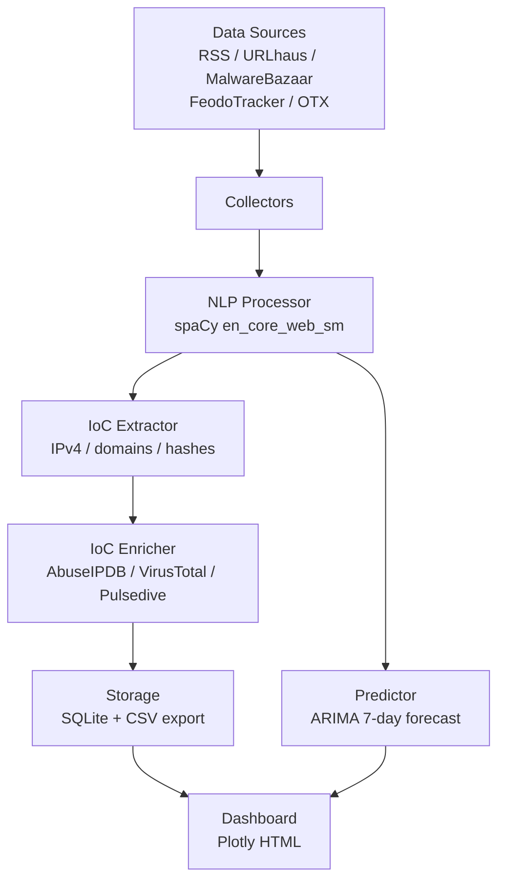
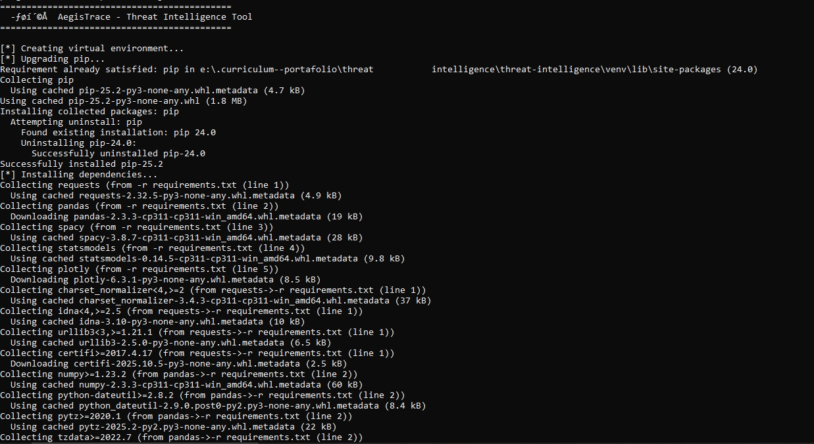
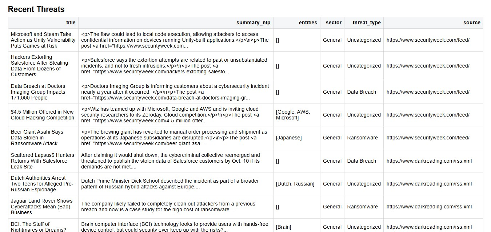
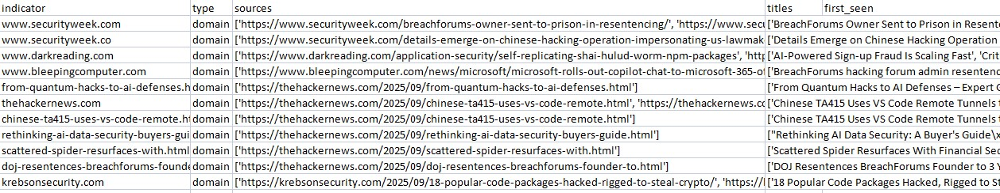

# AegisTrace

[](https://www.python.org/)
[](LICENSE)
[](https://github.com/frangelbarrera/aegistrace-threat-intelligence/actions/workflows/ci.yml)
[](https://github.com/frangelbarrera/aegistrace-threat-intelligence)
[](https://github.com/frangelbarrera/aegistrace-threat-intelligence)
[](https://github.com/frangelbarrera/aegistrace-threat-intelligence)

**AegisTrace** is a modular **Cyber Threat Intelligence (CTI)** pipeline that collects threat data from open sources, extracts Indicators of Compromise (IoCs) such as IP addresses, domains and file hashes, enriches them with external intelligence feeds, and forecasts threat activity using ARIMA time-series models.

It is built for **SOC analysts, threat hunters, incident responders and security researchers** who need a single, reproducible pipeline that turns raw open-source feeds into an interactive dashboard plus a CSV of enriched indicators.

---

## Key Features

- **Multi-source collection** - RSS feeds, URLhaus, MalwareBazaar, FeodoTracker, and optional AlienVault OTX.
- **NLP processing** - spaCy-based entity extraction, keyword-driven threat classification, and short summaries.
- **IoC extraction** - regex-based detection of IPv4 addresses, domains, MD5/SHA1/SHA256 hashes, with cross-threat deduplication.
- **Best-effort enrichment** - AbuseIPDB (IP reputation), VirusTotal (file hash analysis) and Pulsedive (tags, activity status). The pipeline never crashes when an API key is missing or a request fails.
- **ARIMA forecasting** - 7-day threat trend forecast using real historical counts from the local SQLite database, with a deterministic synthetic fallback when history is empty.
- **Interactive dashboard** - KPIs, three Plotly charts, recent-threats table and enriched-IoCs table, exported as a standalone HTML file.
- **CLI + library** - run as `python -m aegistrace` or `aegistrace` after `pip install`, or import `aegistrace.run` from your own code.

---

## Architecture



---

## Quick Start

### 1. Clone and install

```bash
git clone https://github.com/frangelbarrera/aegistrace-threat-intelligence.git
cd aegistrace-threat-intelligence

python -m venv venv
source venv/bin/activate    # Linux/macOS
# venv\Scripts\activate     # Windows

pip install -r requirements-dev.txt
pip install -e .
python -m spacy download en_core_web_sm
```

### 2. Run the pipeline

```bash
# Run every source with enrichment and forecasting enabled
python -m aegistrace

# Restrict to specific sources, skip enrichment
python -m aegistrace --sources urlhaus,feodotracker --no-enrich

# Skip the ARIMA forecast (faster, dashboard shows empty forecast chart)
python -m aegistrace --no-forecast --output my_dashboard.html
```

### 3. Open the outputs

- `dashboard.html` - interactive Plotly dashboard.
- `iocs_enriched.csv` - enriched IoCs ready for ingestion into a SIEM or ticketing system.
- `threatintel.db` - SQLite database with `threats` and `iocs` tables.

### 4. (Optional) Enable API keys

All keys are read from environment variables. The pipeline runs without any of them; setting them unlocks richer enrichment.

```bash
cp .env.example .env
# Edit .env and fill in your real keys
export $(grep -v '^#' .env | xargs)   # Linux/macOS
```

Supported variables: `OTX_API_KEY`, `ABUSEIPDB_API_KEY`, `VIRUSTOTAL_API_KEY`, `PULSEDIVE_API_KEY`. See `.env.example` for details.

---

## Project Structure

```
aegistrace-threat-intelligence/
├── aegistrace/                    # Main package (importable, pip-installable)
│   ├── __init__.py                # Package metadata (__version__)
│   ├── __main__.py                # python -m aegistrace entry point
│   ├── cli.py                     # argparse CLI
│   ├── config.py                  # Env-driven configuration
│   ├── collectors.py              # Source fetchers + fetch_all_sources
│   ├── nlp_processor.py           # spaCy entity extraction + classification
│   ├── ioc_extractor.py           # Regex-based IoC extraction
│   ├── enricher.py                # Best-effort external API enrichment
│   ├── predictor.py               # ARIMA 7-day forecast
│   ├── storage.py                 # SQLite persistence
│   ├── dashboard_generator.py     # Plotly HTML dashboard
│   ├── logging_config.py          # Shared logging setup
│   └── main.py                    # Pipeline orchestrator (run())
├── tests/                         # pytest suite, 91% coverage
│   ├── conftest.py                # Shared fixtures
│   ├── test_collectors.py
│   ├── test_config_and_package.py
│   ├── test_cli_and_main.py
│   ├── test_dashboard_generator.py
│   ├── test_enricher.py
│   ├── test_ioc_extractor.py
│   ├── test_nlp_processor.py
│   ├── test_predictor.py
│   └── test_storage.py
├── .github/workflows/ci.yml       # CI: ruff + pytest on Python 3.10/3.11/3.12
├── .pre-commit-config.yaml        # ruff + ruff-format + sanity hooks
├── .gitignore
├── .env.example                   # API keys template
├── main.py                        # Backward-compat shim (python main.py)
├── pyproject.toml                 # PEP 621 packaging + tool config
├── requirements.txt               # Runtime deps (version-pinned)
├── requirements-dev.txt           # Dev deps (pytest, ruff, mypy, responses)
├── setup_aegistrace.bat           # One-click Windows setup
├── CONTRIBUTING.md
├── CHANGELOG.md
├── LICENSE
└── README.md
```

---

## CLI Reference

```
usage: aegistrace [-h] [--version] [--sources SOURCES] [--no-enrich]
                  [--no-forecast] [--output OUTPUT] [--csv CSV] [--verbose]

AegisTrace - Cyber Threat Intelligence pipeline.

options:
  -h, --help            show this help message and exit
  --version             show program's version number and exit
  --sources SOURCES     Comma-separated subset: otx,rss,urlhaus,malwarebazaar,feodotracker
  --no-enrich           Skip IoC enrichment (faster, no external API calls)
  --no-forecast         Skip ARIMA forecasting
  --output OUTPUT       HTML dashboard output path (default: dashboard.html)
  --csv CSV             Enriched IoCs CSV output path (default: iocs_enriched.csv)
  --verbose             Enable DEBUG logging
```

Exit codes: `0` success, `1` warnings (e.g. all sources failed and mock data was used), `2` error.

---

## Using AegisTrace as a Library

```python
from aegistrace.main import run

result = run(
    sources=["urlhaus", "rss"],
    enrich=True,
    forecast=True,
    output="dashboard.html",
    csv_path="iocs.csv",
)

print(f"Collected {len(result.threats)} threats")
print(f"Extracted {len(result.iocs_enriched)} IoCs")
print(f"Dashboard: {result.dashboard_path}")
```

Public functions in each module are documented with Google-style docstrings and type hints; see the `aegistrace/` source for details.

---

## Output Examples

Console output when running the pipeline:



Interactive dashboard with KPIs, charts and IoC table:



Enriched IoCs CSV export:



---

## Technology Stack

| Layer            | Technology                                  |
|------------------|---------------------------------------------|
| Language         | Python 3.10+ (tested on 3.10, 3.11, 3.12)   |
| NLP              | spaCy `en_core_web_sm`                       |
| Visualization    | Plotly                                        |
| Data processing  | pandas                                        |
| Forecasting      | statsmodels (ARIMA)                           |
| Storage          | SQLite (stdlib `sqlite3`)                     |
| HTTP             | requests                                      |
| Testing          | pytest + pytest-cov + responses               |
| Linting          | ruff                                          |
| Typing           | mypy (best-effort)                            |

---

## Development

### Run the test suite

```bash
pytest -v --cov=aegistrace --cov-report=term-missing
```

### Lint and format

```bash
ruff check aegistrace tests
ruff format aegistrace tests
```

### Install pre-commit hooks (recommended)

```bash
pip install pre-commit
pre-commit install
```

See [CONTRIBUTING.md](CONTRIBUTING.md) for the full development workflow.

---

## Roadmap

Planned (no promises, no dates):

- [ ] MITRE ATT&CK technique mapping for extracted IoCs.
- [ ] STIX 2.1 output for SIEM/SOAR interoperability.
- [ ] MISP feed integration (alternative to OTX).
- [ ] Dockerfile + docker-compose for one-command deployment.
- [ ] FastAPI read-only API for programmatic dashboard access.
- [ ] Sector inference for URLhaus / MalwareBazaar records (currently `"Unknown"`).

---

## License

MIT - see [LICENSE](LICENSE).
